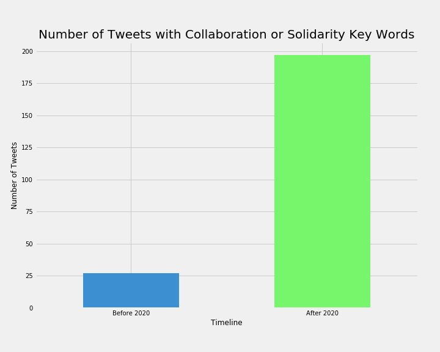

# COVID Research Tweet Analysis

### Executive Summary

Globally, people are calling for collaboration to develop COVID-19 treatments and vaccines that are available to everyone. Our hypothesis is that institutions are also calling for this change now. This could be a moment to disrupt our typical R&D system–the one that upholds profits over lives. 

---

### Problem Statement
A COVID-19 vaccine or treatment won't save us, but a free one will. We need to ensure that the public funding going into COVID-19 research ensures that the vaccine and treatment is priced at cost and available to everyone.

---

### Data

#### Twitter
To start, I pulled tweets from WHO, CEPIvaccine, EU_Commission, and AstraZeneca six months before the pandemic hit (January 2020), and six months after. Modules for pulling tweets was done in Python [here](./src/scraper/tweet_scraper.py).

#### Description of Data

|Date Range|WHO Tweets|CEPI|EU_Commission|AstraZeneca|
|:---|:---|:---|:---|:---|
|Between June - December 2019|2347|621|1580|587|
|Between January - June 2020|3844|483|1180|157|

### Data Cleaning

Regex data cleaning module for tweets can be seen [here](./src/scraper/words.py). I used regular expressions to remove special characters, numeric characters, html, and url's.

### Exploring the Data

The data exploratory work was done in Python [here](./code/002_EDA.ipynb).

I first wanted to explore the most commmon bigrams before and after 2020. This was an iterative process:

1. Look at the most common words in my dataset
2. Determine which ones should be considered as stop words
3. Add to my custom list of stop words
4. Repeat until I get common words that have actual meaning

The most common bigrams between June - December 2019 were:

The most common bigrams between January - June 2020 were:

You can see that the word "solidarity" becomes one of the top words after the pandemic hit.

### Looking for Tweets with Specific Keywords

Next, I wanted to explore how many tweets included key words around the theme of collaboration/solidarity.

I pulled all the tweets that included the words "collaboration" or "solidarity."

You can see the number of tweets with "collaboration" or "solidarity" keywords increased after 2020.

**Here are some examples of these tweets:**
- "There has been an extraordinary response to our call for countries to join the solidarity trial which is comparing four drugs and drug combinations so far countries have either joined the trial or are in the process of joining"
- "Only together can we get through the pandemic in national unity and global solidarity"
- "Through solidarity through trust through working together we have a chance to turn a tragic pandemic into a beacon of hope for the future of our planet"

Full list of collaboration/solidarity tweets can be seen [here](./data/who_collab_tweets.csv)

---

### Next Steps

1. Pull tweets from other organizations
2. Add more keywords to collaboration theme
3. Explore if tweets are similar to AC words
4. Visualize findings